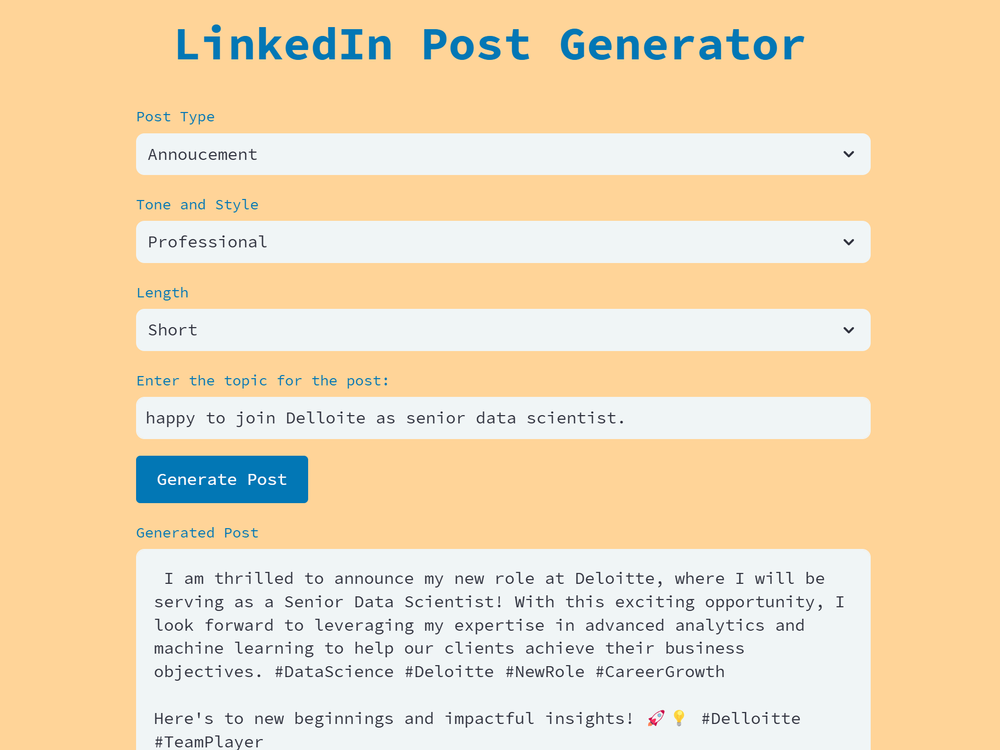

## LinkedIn Post Generator from your local without Internet or GPU.

This app will allow users to generate engaging and professional LinkedIn posts with the help of the Phi 3 model. The UI will feature input fields and options for users to provide the necessary context and preferences for their desired post.

### User Input

1. **Post Type**: Users can select the type of post they want to generate, such as a thought leadership piece, industry update, job posting, or company announcement.

2. **Context**: Users will provide relevant context for the post, such as the industry, target audience, key topics or keywords, and any specific information or data they want to include.

3. **Tone and Style**: Users can specify the desired tone and style for the post, such as professional, casual, informative, or persuasive.

4. **Length**: Users can set the preferred length of the post, either by specifying a word count or choosing from options like "short," "medium," or "long."

### Post Generation

Once the user has provided the necessary input, the app will send the information to the Phi 3 model, which will generate a well-written and engaging LinkedIn post based on the specified parameters.

The generated post will be displayed in the app's UI, allowing users to review and make any necessary edits or modifications before posting.